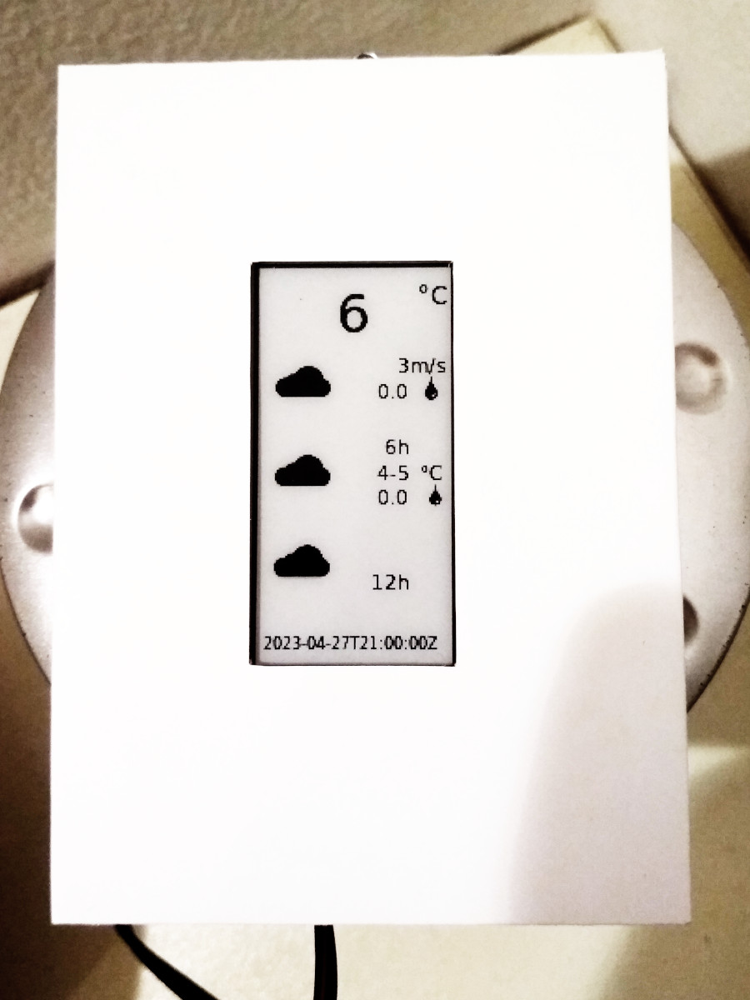
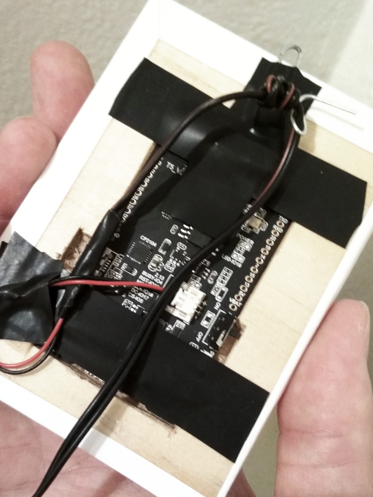

# LILYGO T5 Wifi E-Paper weather dashboard

## Server
- generates a SVG file using a SVG template and data downloaded from a weather forecast API
- converts the SVG to a bitmap using cairosvg (converting using `convert` command line tool gave me nicer results but I can call cairosvg directly from python)
- converts the bitmap to a format understood by the display
- serves the bitmap on a HTTP server

### Install
- install pip and cairo `apt install python3-pip cairosvg`
- run `./server/setup.sh` to install python dependencies
- `nohup ./server/server.py`

## Client
Arduino sketch running on the LILYGO T5 board
- downloads a bitmap over Wifi
- displays the bitmap
- goes to deep sleep

### Install
- Install Arduino IDE
- File -> Preferences -> Additional boards manager URLs: `https://dl.espressif.com/dl/package_esp32_index.json`
- Boards Manager: Install `esp32 by Espressif Systems`
- Select Tools -> Board -> esp32 -> ESP32 Dev Module
- In Library Manager install:
  - HttpClient 2.2.0 by Adrian McEwen
  - Adafruit GFX Library by Adafruit (install with dependencies)
- Manually install:  
  - [michaelkamprath/ePaperDriverLib](https://github.com/michaelkamprath/ePaperDriverLib) -> [Download ZIP](https://github.com/michaelkamprath/ePaperDriverLib/archive/refs/heads/master.zip) -> extract to `~/Arduino/libraries`
- The [Official LilyGO repo](https://github.com/Xinyuan-LilyGO/LilyGo-T5-Grayscale) tells you to install 
[CP210X Driver](https://www.silabs.com/products/development-tools/software/usb-to-uart-bridge-vcp-drivers). 
On Linux I didn't have to. 
I also didn't need anything from that repo except what's mentioned above.
- In `sketch.ino` change your server location and wifi password
- Upload
